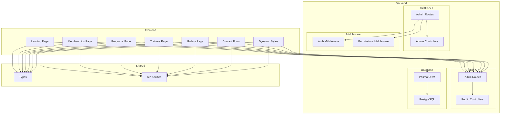

    

    <b>Automatic Architecture Diagrams from Code</b> 
    <a href="https://github.com/swark-io/swark">GitHub</a> • <a href="https://swark.io">Website</a> • <a href="mailto:contact@swark.io">Contact Us</a>

## Usage Instructions

1. **Render the Diagram**: Use the links below to open it in Mermaid Live Editor, or install the [Mermaid Support](https://marketplace.visualstudio.com/items?itemName=bierner.markdown-mermaid) extension.
2. **Recommended Model**: If available for you, use `claude-3.5-sonnet` [language model](vscode://settings/swark.languageModel). It can process more files and generates better diagrams.
3. **Iterate for Best Results**: Language models are non-deterministic. Generate the diagram multiple times and choose the best result.

## Generated Content
**Model**: GPT-4o - [Change Model](vscode://settings/swark.languageModel)  
**Mermaid Live Editor**: [View](https://mermaid.live/view#pako:eNqNk81u4yAUhV8FsW5fIIuRnLhJ2sQJbjIrPIsbQ200NkSANbKqvvuA_6CdLsarc8-9fByDeMelYhyvcCErDfcaXdNCImS621hutZKWS-ZNhBJ6BMmErBCBiv8azTXNeHvj2tTibuLGhhKtHKb95Kb0qkFINx-7T3QHTcN1H5tbunG7Q2nRVul2Mnc07SW0okQX2zfcDPaQ8FPwNZS_l9yLS7pb41Ym5HlsILSnk_eqOjvR_Pc8-z6CVj7b3Fw2i8AJa4WMuS90tL5gD5P9f9RMMNbwP6D5vP5Ik87GjYWcUcJ1K4wRSpp_B77Dp2DhBmaBn9yFCdMCOr9mC_dMiTK20vySH2PWd4d-qd2G05kTeu3vy5_n1J0N-mlFI6z4emkJenz8gfZeroPcBJkG-RTkNsjdLH2xH4rhJl4GefDyMMiTl6dBnsfpceQYZBaHIiEUCaFICEVCKBJCkRCKxLg84PKAywMuD7g84PKAcxI_4NZdNQjm3u17gW3NW17gFSow42_QNbbAH26ouzOwPBXg3yBeWd3xBwydVZdelnOtVVfVePUGjeEffwGSJTac) | [Edit](https://mermaid.live/edit#pako:eNqNk81u4yAUhV8FsW5fIIuRnLhJ2sQJbjIrPIsbQ200NkSANbKqvvuA_6CdLsarc8-9fByDeMelYhyvcCErDfcaXdNCImS621hutZKWS-ZNhBJ6BMmErBCBiv8azTXNeHvj2tTibuLGhhKtHKb95Kb0qkFINx-7T3QHTcN1H5tbunG7Q2nRVul2Mnc07SW0okQX2zfcDPaQ8FPwNZS_l9yLS7pb41Ym5HlsILSnk_eqOjvR_Pc8-z6CVj7b3Fw2i8AJa4WMuS90tL5gD5P9f9RMMNbwP6D5vP5Ik87GjYWcUcJ1K4wRSpp_B77Dp2DhBmaBn9yFCdMCOr9mC_dMiTK20vySH2PWd4d-qd2G05kTeu3vy5_n1J0N-mlFI6z4emkJenz8gfZeroPcBJkG-RTkNsjdLH2xH4rhJl4GefDyMMiTl6dBnsfpceQYZBaHIiEUCaFICEVCKBJCkRCKxLg84PKAywMuD7g84PKAcxI_4NZdNQjm3u17gW3NW17gFSow42_QNbbAH26ouzOwPBXg3yBeWd3xBwydVZdelnOtVVfVePUGjeEffwGSJTac)

